# Architecture Documentation

This document describes the system architecture, data flow, and design decisions for the PDF Review & Versioning Tool.

## High-Level Architecture

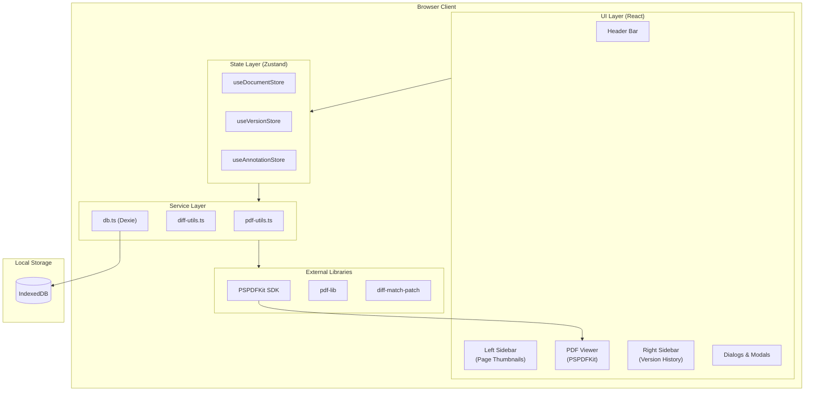

## Data Flow - Document Upload

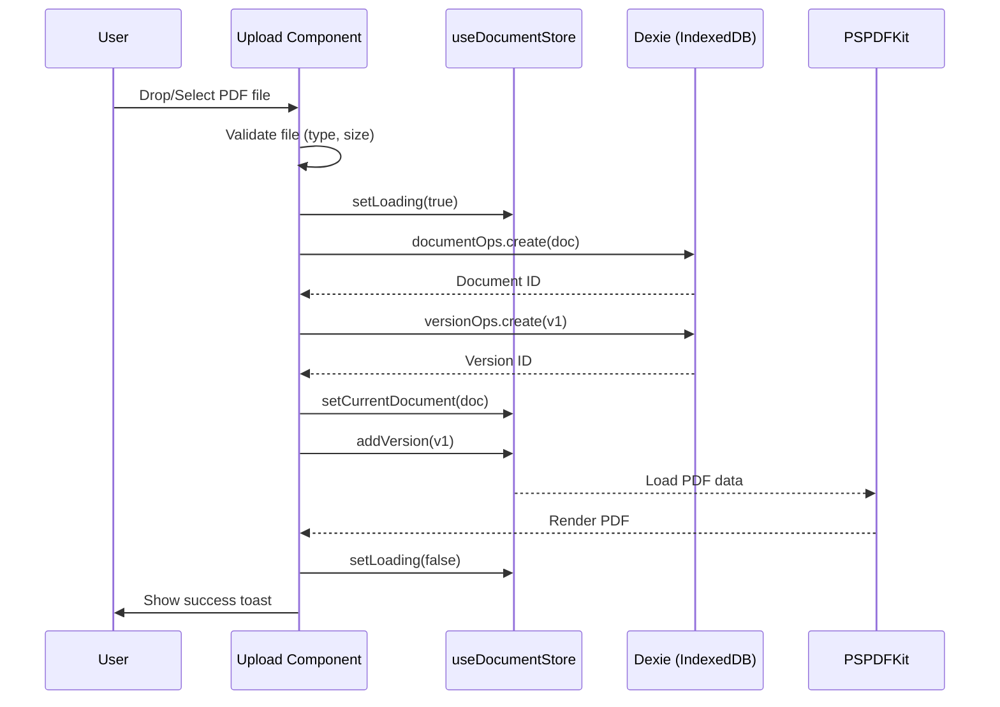

## Data Flow - Version Creation

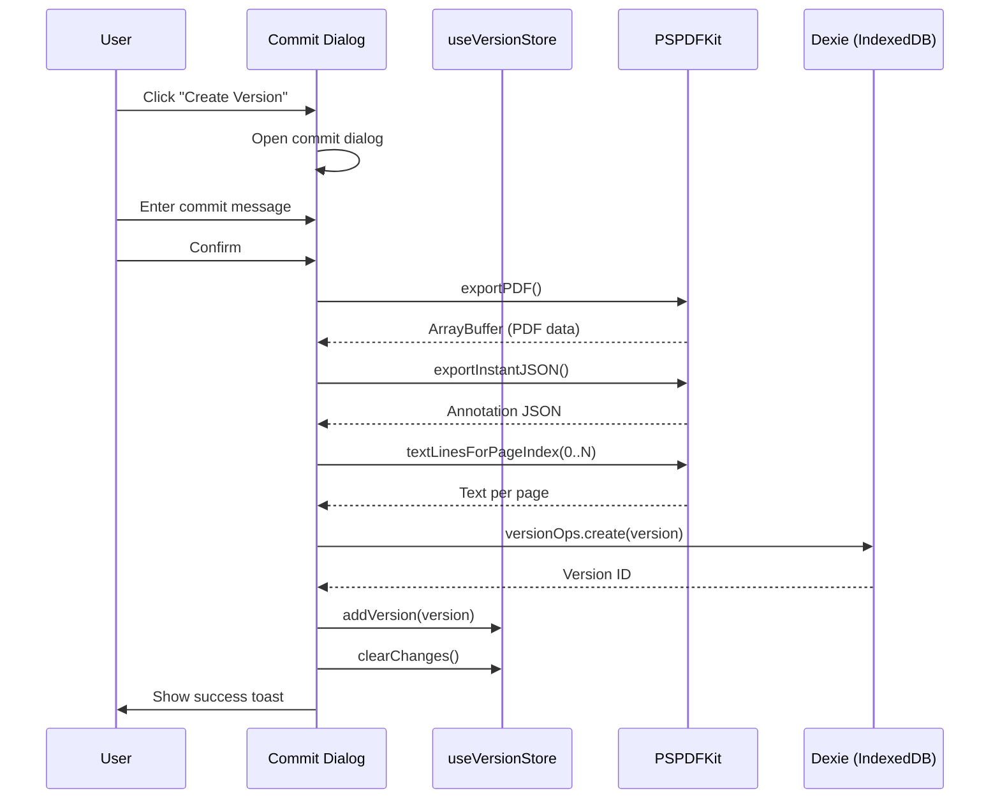

## Data Flow - Version Switching

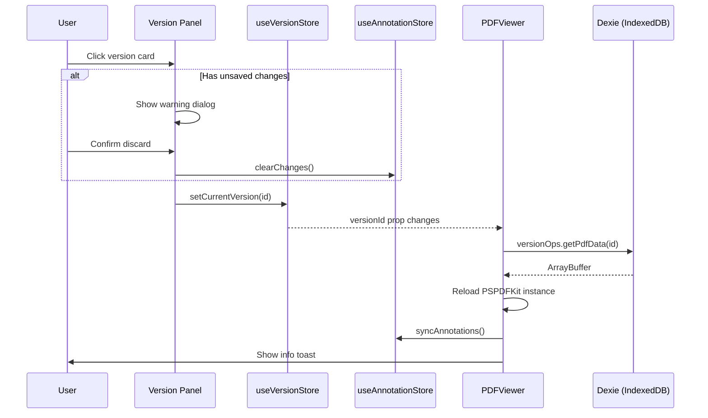

## Data Flow - Version Comparison

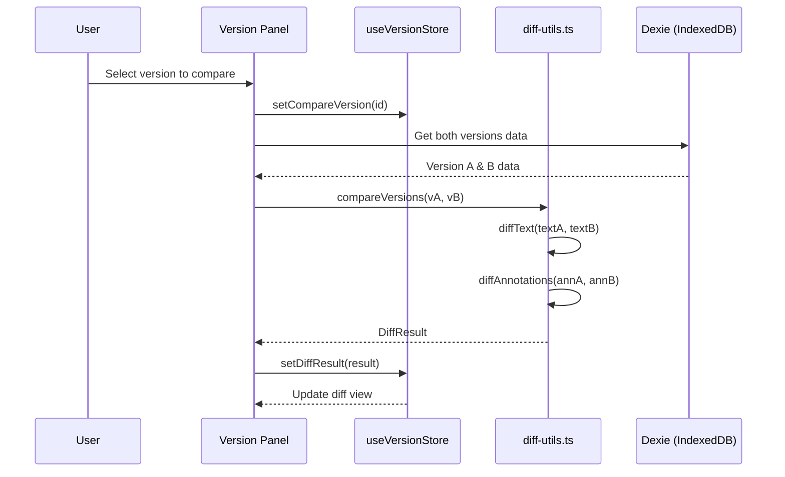

## Component Hierarchy

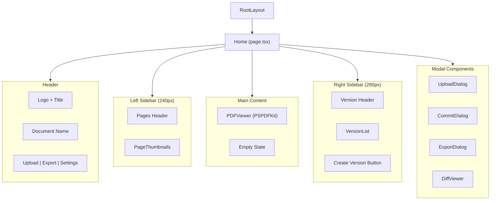

## State Management

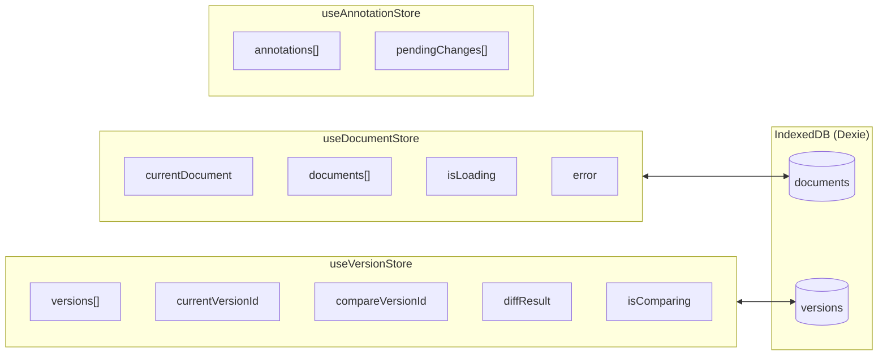

## Database Schema

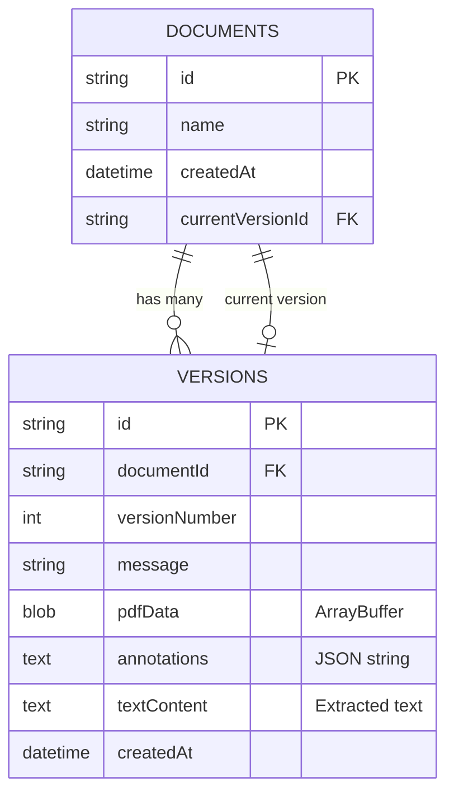

## Type Definitions

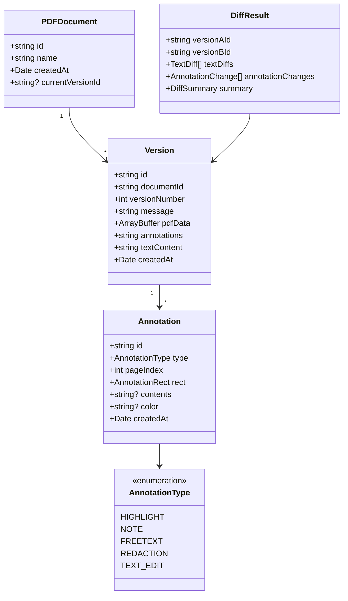

## Production Architecture (Scaled Up)

For a production deployment with cloud sync and collaboration:

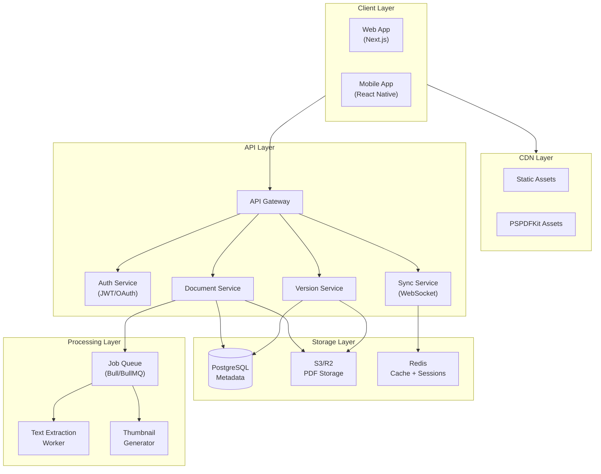

### Production Considerations

| Concern | Solution |
|---------|----------|
| **PDF Storage** | S3/R2 for scalable blob storage, signed URLs for secure access |
| **Real-time Sync** | WebSocket connections via Redis pub/sub for collaboration |
| **Text Extraction** | Background workers using pdf.js or server-side PSPDFKit |
| **Caching** | Redis for session data, CDN for static assets |
| **Authentication** | JWT tokens with refresh, OAuth for SSO |
| **Rate Limiting** | API Gateway with per-user limits |
| **Monitoring** | Prometheus + Grafana, error tracking with Sentry |

## Key Design Principles

1. **Local-First**: All data stored in IndexedDB for offline capability
2. **Immutable Versions**: Versions are never modified after creation
3. **Binary Data Isolation**: PDF ArrayBuffers never stored in React state
4. **Type Safety**: Comprehensive TypeScript types, no `any`
5. **Component Isolation**: Each component has single responsibility
6. **Lazy Loading**: PSPDFKit loaded dynamically to reduce bundle size

## UI Theme Strategy

The application uses a **mixed theme** approach:
- **Header**: Light background (`bg-card`) with standard foreground colors
- **Sidebars**: Dark theme (`#1a1a2e`) with slate-colored text for document navigation contrast
- **Main viewer area**: Light neutral background for optimal PDF readability
- **Accents**: Blue (`blue-500`) for selection states, active pages, and current version highlighting

This avoids a full dark mode toggle while providing visual hierarchy that separates navigation (dark) from content (light).

## Upload-to-Viewer Flow

```
No Document                    Document Loaded
┌──────────────────────┐      ┌───┬──────────────┬────┐
│       Header         │      │   │   Header      │    │
├──────────────────────┤      ├───┼──────────────┼────┤
│                      │      │   │              │    │
│                      │      │ P │              │ V  │
│   Full-screen        │ ──►  │ a │  PDF Viewer  │ e  │
│   Upload Drop Zone   │      │ g │  (PSPDFKit)  │ r  │
│                      │      │ e │              │ s  │
│                      │      │ s │              │    │
└──────────────────────┘      └───┴──────────────┴────┘
```

Sidebars only render when a document is loaded, keeping the upload screen clean and focused.

## Annotation Event Flow

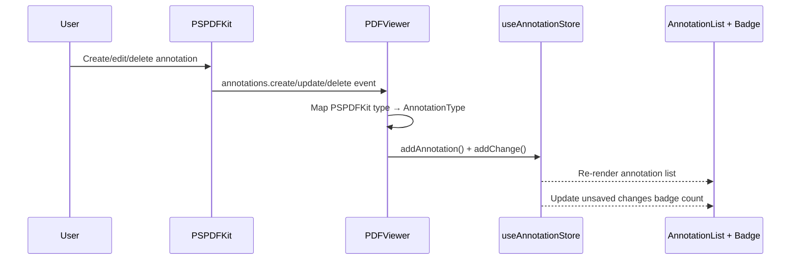

The annotation store tracks two arrays:
- `annotations[]` — current snapshot of all annotations on the document
- `pendingChanges[]` — change log since last version commit (drives the "unsaved changes" badge)
