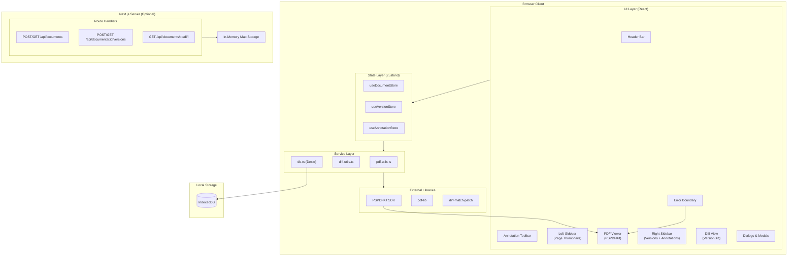
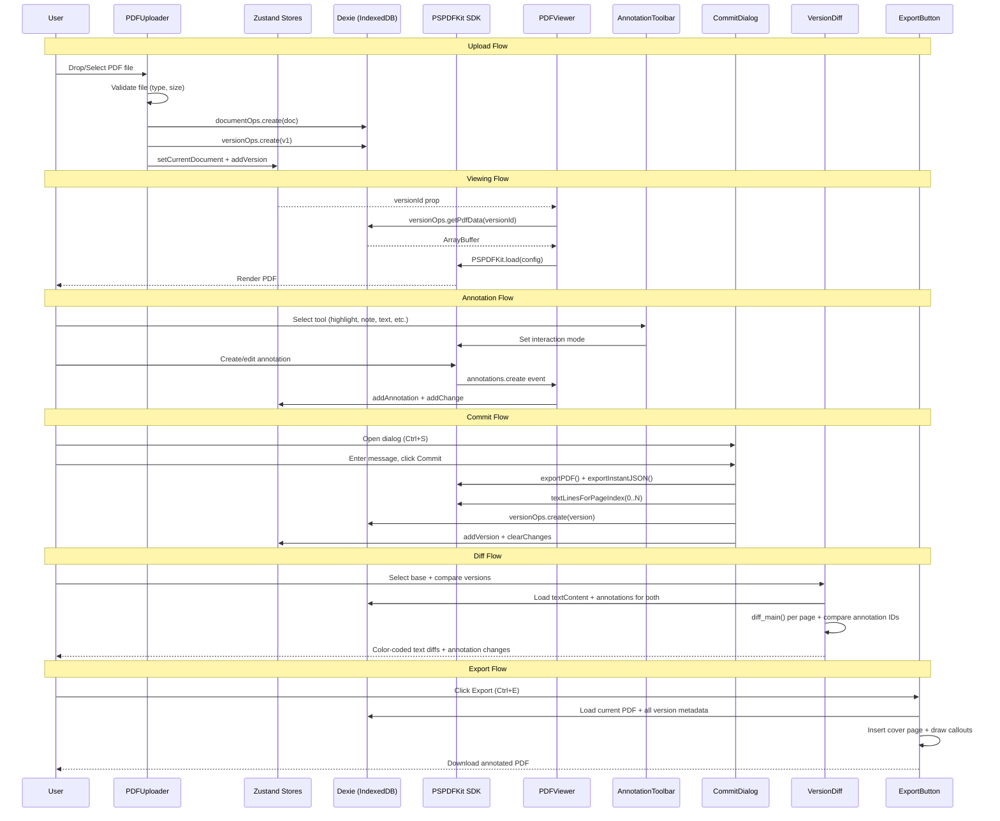
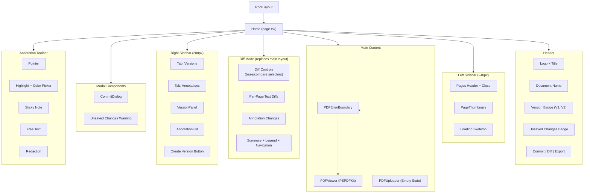
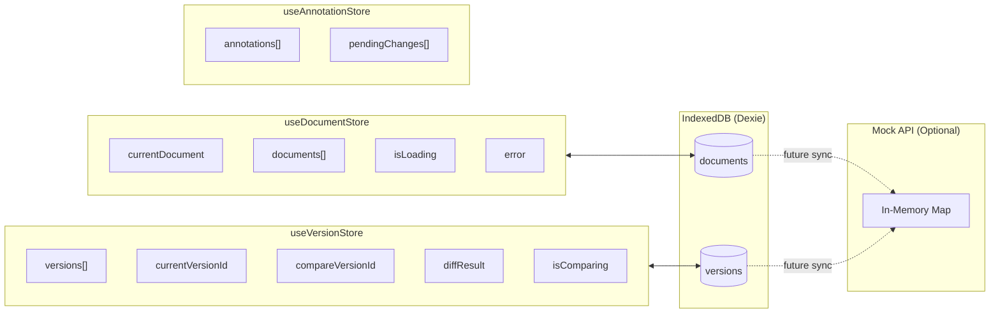
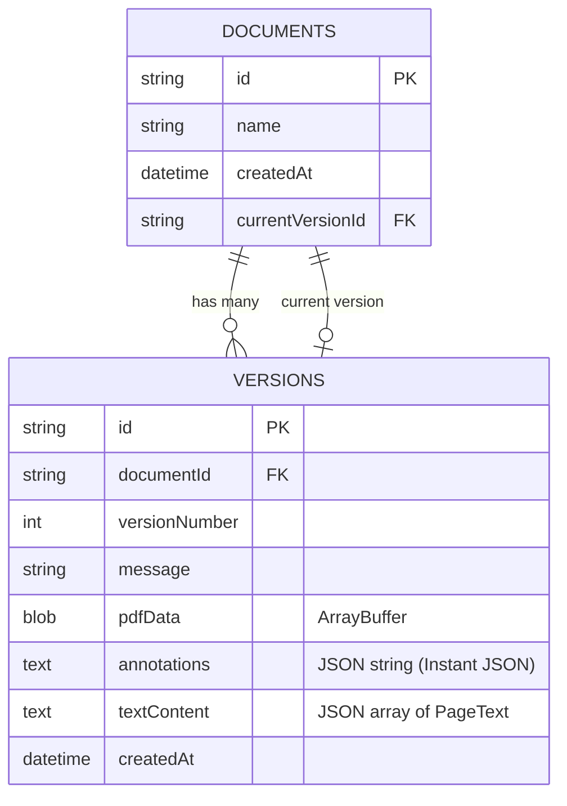
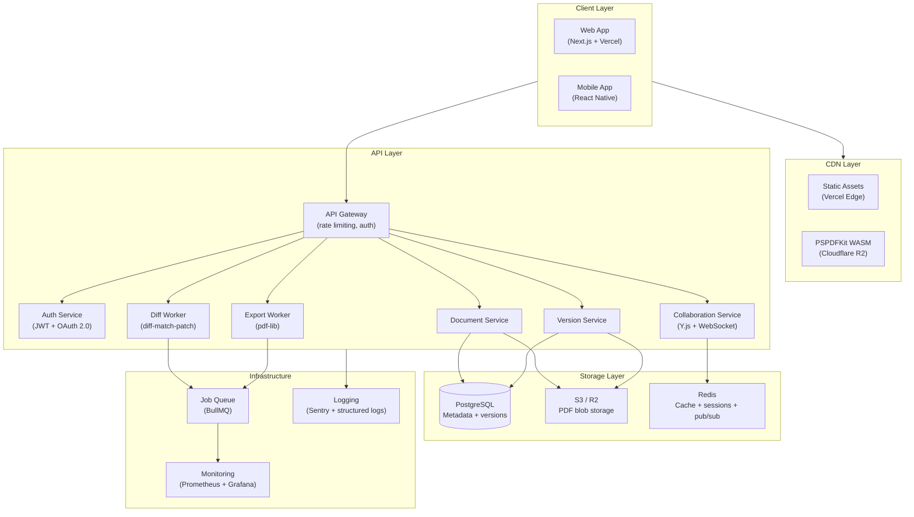
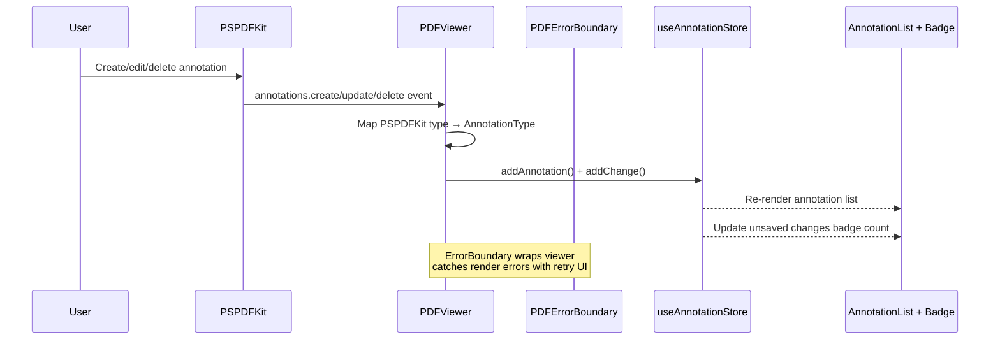
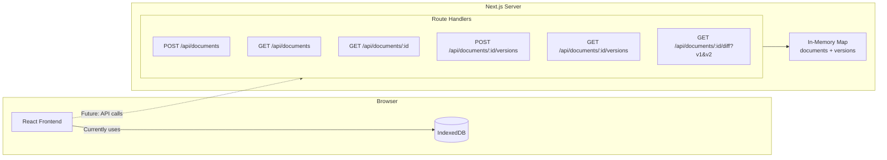

# Architecture Documentation

This document describes the system architecture, data flow, and design decisions for the PDF Review & Versioning Tool.

## 1. High-Level Architecture



## 2. Data Flow — Full User Journey



## 3. Component Hierarchy



## 4. State Management



## 5. Database / IndexedDB Schema



### Mock API In-Memory Schema

The mock backend mirrors the IndexedDB schema using `Map<string, StoredDocument>` and `Map<string, StoredVersion>`. Version responses exclude `pdfData` to keep payloads small.

## 6. Production Architecture (Scaled Up)



## Key Scaling Decisions

| Concern | Current (Local-First) | Production (Cloud) |
|---------|----------------------|-------------------|
| **PDF Storage** | IndexedDB ArrayBuffer | S3/R2 with signed URLs for secure access |
| **Metadata** | IndexedDB via Dexie | PostgreSQL with proper indexing |
| **State** | Zustand (client-only) | Zustand + server state sync (React Query) |
| **Diff Computation** | Client-side (diff-match-patch) | Background worker via job queue |
| **Export Generation** | Client-side (pdf-lib) | Server-side worker for large documents |
| **Real-time Sync** | N/A (single user) | Y.js CRDT + WebSocket via Redis pub/sub |
| **Authentication** | None | JWT tokens + OAuth 2.0 SSO |
| **Rate Limiting** | None | API Gateway with per-user limits |
| **Caching** | Browser cache | Redis for session data, CDN for static assets |
| **Monitoring** | Console logs | Prometheus + Grafana, Sentry for error tracking |
| **Text Extraction** | PSPDFKit client-side | Background workers using server-side PSPDFKit |

## Performance Considerations

| Area | Strategy | Implementation |
|------|----------|----------------|
| **Bundle Size** | PSPDFKit loaded dynamically | `import('pspdfkit')` only when viewer mounts |
| **Memory** | Binary data isolation | PDF ArrayBuffers stored in IndexedDB, never in React state |
| **Rendering** | Zustand store splitting | Three independent stores prevent unnecessary re-renders |
| **Diff Speed** | Parallel computation | `Promise.all` runs text diff and annotation diff concurrently |
| **Export** | Metadata-only loading | Version changelog loads metadata without PDF blobs |
| **Page Load** | Skeleton states | Loading indicators appear immediately while async operations run |
| **Sidebar** | Transition animations | CSS `transition-all duration-200` for smooth collapse/expand |
| **Large PDFs** | Incremental rendering | PSPDFKit virtualizes page rendering; thumbnails use placeholders |

## UI Theme Strategy

The application uses a **mixed theme** approach:
- **Header**: Light background (`bg-card`) with standard foreground colors
- **Sidebars**: Dark theme (`#1a1a2e`) with slate-colored text for document navigation contrast
- **Main viewer area**: Light neutral background for optimal PDF readability
- **Diff mode**: Full-width replacement of normal layout, same light theme
- **Accents**: Blue (`blue-500`) for selection states, active pages, and current version highlighting

This avoids a full dark mode toggle while providing visual hierarchy that separates navigation (dark) from content (light).

## Upload-to-Viewer Flow

```
No Document                    Document Loaded
┌──────────────────────┐      ┌───┬──────────────┬────┐
│       Header         │      │   │   Header      │    │
├──────────────────────┤      ├───┼──────────────┼────┤
│                      │      │   │              │    │
│                      │      │ P │              │ V  │
│   Full-screen        │ ──►  │ a │  PDF Viewer  │ e  │
│   Upload Drop Zone   │      │ g │  (PSPDFKit)  │ r  │
│   (fade-in)          │      │ e │  (fade-in)   │ s  │
│                      │      │ s │              │    │
└──────────────────────┘      └───┴──────────────┴────┘
```

Sidebars only render when a document is loaded, keeping the upload screen clean and focused. Both transitions use CSS fade-in animations.

## Annotation Event Flow



The annotation store tracks two arrays:
- `annotations[]` — current snapshot of all annotations on the document
- `pendingChanges[]` — change log since last version commit (drives the "unsaved changes" badge)

## Mock API Architecture



The mock API and IndexedDB currently operate independently. The frontend uses IndexedDB directly via Dexie. The API routes demonstrate the contract a production backend would implement, enabling a future migration where the frontend swaps Dexie calls for `fetch()` calls.
